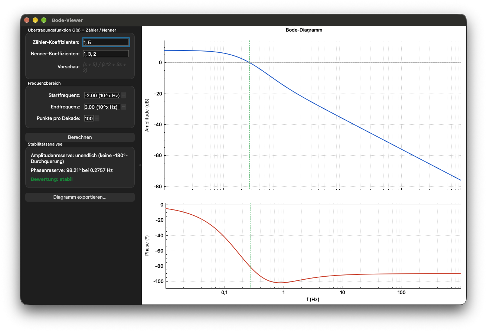

# Bode-Viewer

Der Bode-Viewer ist meine Umsetzung von Aufgabe 3 des Portfolios „Programmierung
mit C/C++" (DLBROEPRS01_D) und beruht auf dem Konzept „Entwurf eines
Bode-Diagramm-Viewers". Die Qt/C++-Desktopanwendung berechnet zu einer
gebrochen-rationalen Übertragungsfunktion `G(s) = Zähler(s) / Nenner(s)`, die
über die Koeffizienten von Zähler- und Nennerpolynom eingegeben wird, den
Amplituden- und den Phasengang und stellt beide als Bode-Diagramm dar.
Zusätzlich ermittelt sie die Amplituden- und die Phasenreserve (Gain und Phase
Margin) und leitet daraus eine Stabilitätsbewertung ab. Das Diagramm lässt sich
als PNG oder JPG im Rasterformat sowie als PDF im Vektorformat exportieren.



## Architektur

```
src/
  core/               Rechenkern in C++17, keine Qt-Abhängigkeit
    TransferFunction  Polynom-Modell, Auswertung G(jω) per Horner-Schema
    BodeCalculator    Frequenzraster, Amplitude/Phase (mit Unwrapping),
                       Reserven per linearer Interpolation
  ui/                 Qt-Widgets-Oberfläche
    MainWindow        Eingabe, Validierung, Ergebnisanzeige, Export-Dialog
    BodePlotWidget    QCustomPlot-Wrapper: Amplitude und Phase als zwei
                       übereinander liegende Teildiagramme, Marker, Export
  main.cpp
tests/
  TestSupport.h/.cpp  Testgerüst mit check() und checkNear()
  test_core.cpp       Modultests des Rechenkerns (ohne Qt)
  test_ui.cpp         Oberfläche, Zusammenspiel mit dem Rechenkern und
                       nachgestellte Benutzereingaben (Qt Test)
external/qcustomplot/ Plotbibliothek eines Drittanbieters (GPL v3)
```

`core` kennt Qt nicht und lässt sich deshalb allein testen und in ein anderes
Programm übernehmen. `ui` greift auf `core` zu, nie umgekehrt. Ist ein Diagramm
fehlerhaft, liegt der Fehler damit eindeutig in der Berechnung oder in der
Darstellung. Klassen, Schnittstellen und wichtige Methoden beschreibt die
Dokumentation.

## Build

Vorausgesetzt werden Qt 6 mit den Modulen Widgets, PrintSupport und Test,
CMake ab Version 3.16 und ein C++17-fähiger Compiler.

```bash
cmake -B build -DCMAKE_PREFIX_PATH=<Pfad-zu-Qt6>
cmake --build build -j
```

`<Pfad-zu-Qt6>` ist der Installationspfad von Qt 6, unter macOS mit Homebrew
`/opt/homebrew`, beim offiziellen Qt-Installer `~/Qt/6.x.y/macos`. Mit
Homebrew führt das beigelegte Skript `./build.sh` diese beiden Befehle aus.

## Tests

Die Tests sind wie der Programmcode in Rechenkern und Oberfläche getrennt, sodass
sich ein Fehler schon beim Test des betroffenen Moduls zeigt.

`bode_core_tests` (`tests/test_core.cpp`) prüft den Rechenkern ohne Qt: Parsen
und Validieren der Koeffizienten, Auswertung von `G(jω)`, Frequenzraster,
Fehlerfälle beim Frequenzbereich sowie Amplitude, Phase und Reserven. Als
Prüfwerte dienen `1/(s+1)` und `1/(s+1)³`, weil sich ihr Frequenzgang
geschlossen angeben und der erwartete Wert von Hand nachrechnen lässt.

`bode_ui_tests` (`tests/test_ui.cpp`) prüft die Oberfläche mit Qt Test. Über
`QTest::keyClicks()` und `QTest::mouseClick()` werden echte Tastatur- und
Mausereignisse eingespeist. Getestet werden der Startzustand, das Eintippen
einer Übertragungsfunktion mit Klick auf „Berechnen", die Fehlermeldungen bei
ungültigen Eingaben und die Weitergabe des Ergebnisses an das Diagramm. Der Lauf
nutzt das Qt-Plattform-Plugin `offscreen` und braucht deshalb keine
Grafiksitzung.

Das Testgerüst in `tests/TestSupport.h` und `tests/TestSupport.cpp` habe ich
selbst geschrieben, um keine weitere Bibliothek zu benötigen. Beide
Testprogramme sind bei CTest registriert:

```bash
ctest --test-dir build --output-on-failure
```

Beim direkten Aufruf gibt jedes Testprogramm jede Prüfung als eigene Zeile aus,
was die Fehlersuche erleichtert:

```bash
./build/bode_core_tests
```

```bash
QT_QPA_PLATFORM=offscreen ./build/bode_ui_tests
```

Der Exit-Code ist 0, wenn alle Prüfungen bestanden sind, sonst 1.

## Ausführen

```bash
./build/BodeViewer
```

Beim Start rechnet die Anwendung das voreingestellte Beispiel mit dem Zähler
`1, 5` und dem Nenner `1, 3, 2` durch und zeigt gleich ein Bode-Diagramm.

## Bedienung

Die Zähler- und Nennerkoeffizienten werden kommagetrennt und mit der höchsten
Potenz zuerst eingegeben, also `1, 5` für `1·s + 5` und `1, 3, 2` für
`s² + 3s + 2`. Dezimalstellen werden mit Punkt geschrieben (`0.5`), weil das
Komma die Koeffizienten trennt. Den Frequenzbereich legt man als Start- und
Endexponent zur Basis 10 in Hz fest. Die Punkte pro Dekade bestimmen die
Feinheit des Frequenzrasters und damit die Genauigkeit der interpolierten
Reserven. „Berechnen" aktualisiert Diagramm, Amplitudenreserve, Phasenreserve
und Stabilitätsbewertung. Über „Diagramm exportieren…" wählt man einen
Dateinamen, dessen Endung `.png`, `.jpg` oder `.pdf` das Format festlegt; ohne
erkannte Endung wird PNG geschrieben.

Die Stabilitätsbewertung gilt nur im eingegebenen Frequenzbereich. Liegt eine
Durchtrittsfrequenz außerhalb, wird das System unter Umständen fälschlich als
stabil angezeigt. Außerdem setzt sie ein im offenen Kreis stabiles
Minimalphasensystem voraus, was das Programm nicht prüft.

## Lizenzhinweis

`external/qcustomplot` enthält QCustomPlot 2.1.1 unter der GPL v3, die Lizenz
liegt in `external/qcustomplot/GPL.txt`. Die Bibliothek wird für Darstellung
und Export des Diagramms verwendet.
